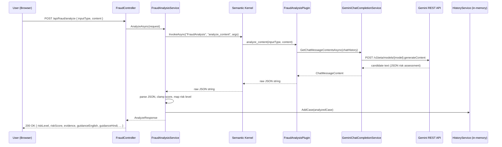
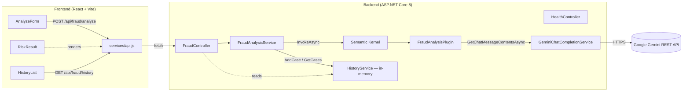

# ScamShield AI — Architecture

## Overview

ScamShield AI is a multilingual fraud/scam detection assistant. A user submits a suspicious
message, email, URL, or screenshot's text; the backend runs it through Google Gemini via
Microsoft Semantic Kernel, and returns a structured, explainable risk assessment with safety
guidance in English and Hindi.

## Stack

| Layer | Technology |
|---|---|
| Backend | ASP.NET Core 8 Web API (C#) |
| AI orchestration | Microsoft Semantic Kernel 1.30 |
| LLM | Google Gemini (`gemini-2.0-flash` by default), called via a hand-written `IChatCompletionService` over Gemini's REST API |
| Frontend | React 19 + Vite (plain JS/JSX) |
| History storage | In-memory (`ConcurrentDictionary`), per MVP scope — no database |
| API docs | Swagger / OpenAPI (Swashbuckle) |

## Why a hand-written Gemini connector

Semantic Kernel does not ship a stable, officially-supported Gemini connector — the only
Microsoft package for Google models (`Microsoft.SemanticKernel.Connectors.Google`) has stayed in
`1.x-alpha` for its entire lifetime. Rather than depend on an experimental package, the backend
implements `IChatCompletionService` directly against Gemini's `generateContent` REST endpoint
(`AiModel/GeminiChatCompletionService.cs`). This is a thin adapter: it converts a Semantic Kernel
`ChatHistory` into Gemini's `contents`/`system_instruction` request shape, and converts the
response back into `ChatMessageContent`. The rest of the app talks to `IChatCompletionService` and
the `Kernel`, and has no direct dependency on Gemini's wire format — swapping providers later means
writing one new adapter class, not touching controllers, services, or plugins.

## Request flow

## Component map

## Layering rules

- **Controllers** (`Controllers/`) — HTTP concerns only: model binding, status codes, no business logic.
- **Services** (`Services/`) — orchestration and business rules. `FraudAnalysisService` invokes the
  Kernel and maps the AI's JSON output into the API's response DTOs; `HistoryService` is a plain
  in-memory store behind an interface so it can be swapped for a real database later without
  touching controllers.
- **Plugins** (`Plugins/`) — Semantic Kernel functions. `FraudAnalysisPlugin.analyze_content` is the
  only Kernel function; it owns the system prompt and talks to `IChatCompletionService` directly for
  the actual LLM call, then hands back raw JSON for the service layer to parse.
- **AiModel** (`AiModel/`) — the LLM provider adapter (`GeminiChatCompletionService`). This is the
  only place that knows Gemini's REST shape.
- **Models** (`Models/`) — plain DTOs and enums shared across layers.

`HealthController` deliberately has **no dependency on `Kernel` or `IChatCompletionService`** — it
was split out from `FraudController` specifically so `/api/health` keeps working even if the Gemini
API key is missing or invalid. ASP.NET Core resolves all constructor dependencies for a controller
before any action runs, so a health check sharing a controller with AI-dependent actions would fail
if the AI provider was misconfigured.

## Credentials

| Secret | Where it lives | Notes |
|---|---|---|
| `Gemini:ApiKey` | `appsettings.Development.json` (gitignored) or `dotnet user-secrets` | Never committed. `appsettings.json` only holds an empty placeholder. |

## Known limits

- In-memory history — no persistence across restarts (acceptable for this MVP; see README).
- No authentication/authorization on any endpoint.
- Single-provider (Gemini only), no automatic fallback if Gemini is unavailable.
- The AI's JSON output is trusted but validated: if Gemini returns malformed JSON, the plugin falls
  back to a fixed "Suspicious" assessment rather than crashing the request.
